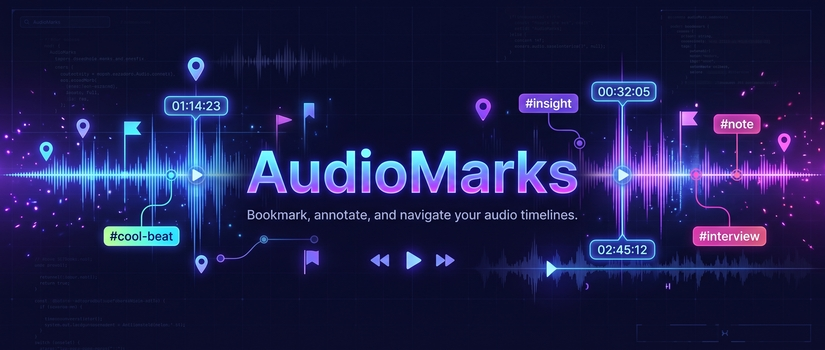
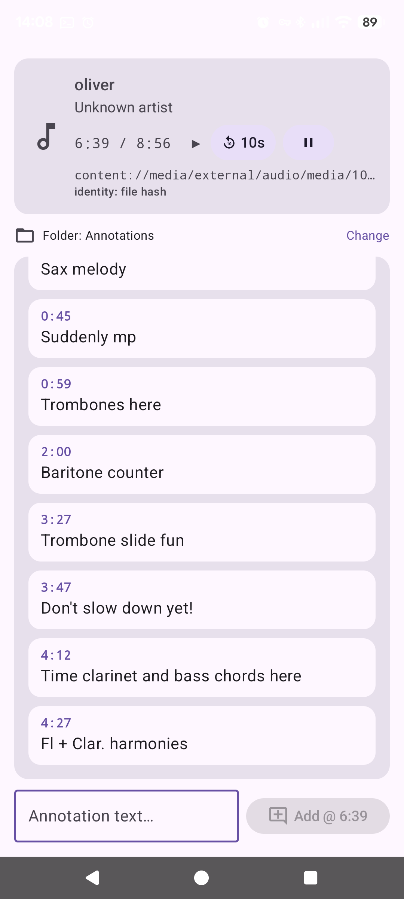

A side-loadable Android app (min/target SDK 36 — Android 16) that watches
whatever music player is running (Gramophone, VLC, …) and lets you attach
timestamped text annotations to the currently playing track.

> [!IMPORTANT]
> This app was vibe-coded by bartowski/ukisai_Swift-1.5-Qwen3.8-27b-GGUF.
> Feel free to fork and update as necessary — use this app at your own peril 💀



*Now Playing panel (with 10 s rewind and play/pause), the annotations
folder, the timestamped bubble list, and the add-at-playhead bar.*

## Features

- **Now Playing panel** — observes the active `MediaSession` of any app
  (title, artist, album art, live playhead, MediaStore URI of the file).
- **Track identity by file hash** — the audio file is MD5-hashed (via its
  MediaStore content URI) and the hash is the annotation key. Hashes are
  cached in `filesDir/hashcache.json` and invalidated on size/mtime change.
  If the file can't be read (e.g. streaming), a `title|artist` key is used.
- **Annotations in a folder of your choice** — picked via the system folder
  picker (SAF); the permission is persisted. One JSON file per track:
  `<md5>.json`.
- **Real-time** — the folder is polled every second, so annotations saved
  from anywhere else appear in the app within ~1 s.
- **Scrolling bubble list** — all annotations for the current track are shown
  as bubbles, auto-scrolling with the playhead. When the playhead reaches an
  annotation's timestamp, that bubble is highlighted for 10 seconds.
- **Add annotation** — one tap stamps the current playhead position.

## Annotation file format

`<key>.json` inside the folder you chose:

```json
{
  "key": "d41d8cd98f00b204e9800998ecf8427e",
  "title": "Example Song",
  "artist": "Example Artist",
  "annotations": [
    { "t": 83.0, "text": "trombone counter", "created": 1759600000000 }
  ]
}
```

`t` is seconds into the track.

## Permissions

| Permission | Why |
|---|---|
| `READ_MEDIA_AUDIO` | Read MediaStore metadata + hash the audio file |
| `FOREGROUND_SERVICE_MEDIA_PLAYBACK` | Required on API 34+ to observe other apps' media sessions |
| (runtime) SAF folder grant | Read/write the annotations folder you pick |

## Notes / limitations

- The app is a **listener only** — it never plays audio.
- File *paths* are not shown (scoped storage); the MediaStore content URI is
  the file location on modern Android.
- Players must expose a `MediaSession` (Gramophone and VLC do).
- On Android 16 the legacy `getActiveSessions()` APIs are gone; the app uses
  the media-key session + `Session2Token` enumeration.

## Building

Requires JDK 17 and an Android SDK with platform 36. A complete
toolchain is kept in `.tools/` (gitignored) so the project is
self-contained across container resets:

```
.tools/jdk            JDK 17
.tools/android-sdk    Android SDK (platform 36, build-tools, platform-tools)
.tools/gradle         Gradle 8.14.3
.tools/gradle-home    Gradle user home (dependency cache, wrapper dists)
```

```sh
cd /projects/audio-annotations
export JAVA_HOME=$PWD/.tools/jdk
export ANDROID_HOME=$PWD/.tools/android-sdk
export GRADLE_USER_HOME=$PWD/.tools/gradle-home
.tools/gradle/bin/gradle assembleDebug
# -> app/build/outputs/apk/debug/app-debug.apk
```

(`sdk.dir` in `local.properties` already points at `.tools/android-sdk`.)

The debug APK is signed with the local debug keystore and is directly
installable (side-loadable).

## Project layout

```
app/src/main/java/com/example/audiomarks/
  PlaybackObserver.kt   # MediaSession discovery + 500 ms playhead ticker
  TrackResolver.kt      # MediaStore lookup + MD5 file identity + hash cache
  AnnotationStore.kt    # SAF folder read/write, 1 s polling, JSON (org.json)
  MainViewModel.kt      # wires the three together
  MainActivity.kt       # Compose UI (now playing, bubbles, add bar, settings)
```
